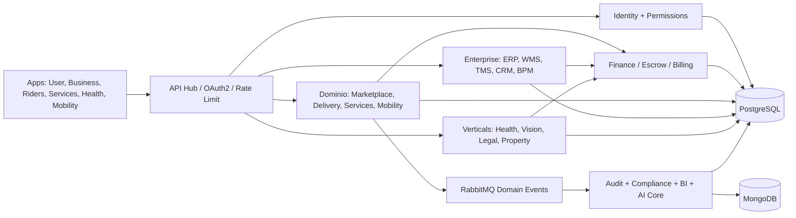
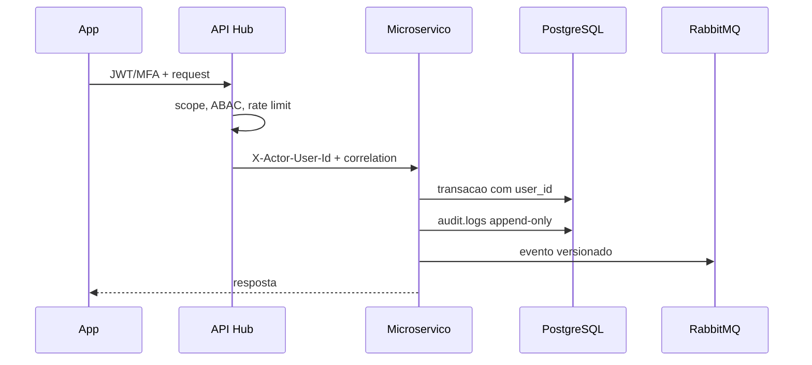

# Arquitetura

## Principios

1. O All-in-One ID nasce em `identity.users` e acompanha toda operacao.
2. Dinheiro, identidade, contratos e auditoria permanecem no PostgreSQL.
3. Memoria IA consentida, feed e telemetria volumosa permanecem no MongoDB.
4. Cada modulo publica contrato HTTP e eventos; nenhum acesso cruza bancos sem
   API ou evento versionado.
5. Empresas e riders nao ficam publicos antes de aprovacao manual.

## Visao de componentes

## Request e auditoria

